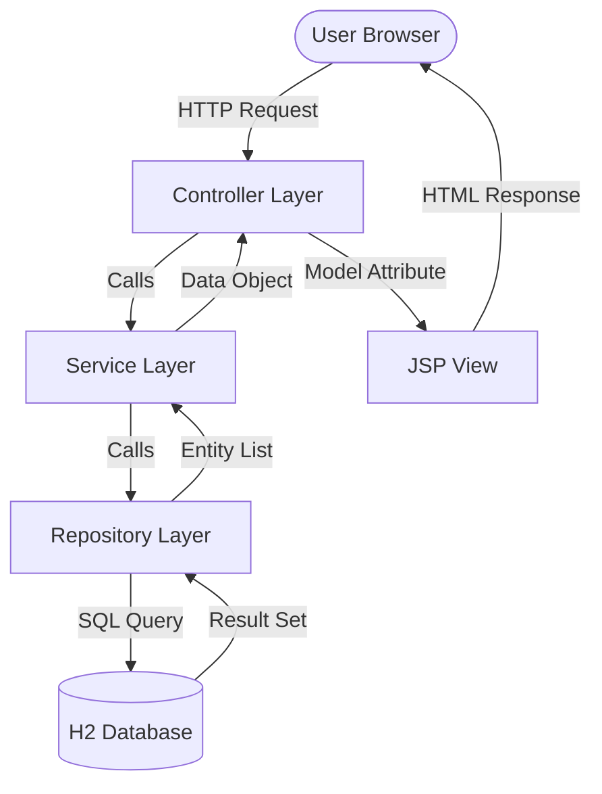

# Project Documentation: Student & Course Management System

## 1. Project Overview
This application is a Spring Boot based web system designed to manage relationships between **Students** and **Courses**. It implements full CRUD functionality and a custom join query to provide a seamless user experience.

---

## 2. System Architecture & Flow
The application follows a standard **Layered Architecture** (MVC):

| Step | Component | Action |
| :--- | :--- | :--- |
| **1** | **View (JSP)** | User interacts with the UI (e.g., clicks 'Add Student' or 'Edit'). |
| **2** | **Controller** | Receives the HTTP Request, processes input, and coordinates with the Service. |
| **3** | **Service Layer** | Contains business logic and calls the appropriate Repository methods. |
| **4** | **Repository** | Performs Database operations using JPA and custom JPQL queries. |
| **5** | **Database (H2)** | Stores and retrieves data in-memory for fast execution. |

### Visual Data Flow Chart


---

## 3. Project Directory Structure (Paths)
The following table outlines the key files and their respective paths within the project:

| Category | File Path | Description |
| :--- | :--- | :--- |
| **Main App** | `src/main/java/com/example/studentcourse/StudentCourseAppApplication.java` | Entry point for the Spring Boot app. |
| **Model** | `src/main/java/com/example/studentcourse/model/Student.java` | Student Entity with Many-to-One mapping. |
| **Model** | `src/main/java/com/example/studentcourse/model/Course.java` | Course Entity with One-to-Many mapping. |
| **Repository** | `src/main/java/com/example/studentcourse/repository/StudentRepository.java` | Contains the Custom Inner Join Query. |
| **Service** | `src/main/java/com/example/studentcourse/service/StudentCourseService.java` | Business logic for Student/Course management. |
| **Controller** | `src/main/java/com/example/studentcourse/controller/StudentCourseController.java` | Handles routing and form submissions. |
| **Resources** | `src/main/resources/application.properties` | App configuration (DB, Port, JSP settings). |
| **Resources** | `src/main/resources/data.sql` | SQL script to seed 10 rows per table. |
| **Styles** | `src/main/resources/static/css/style.css` | Premium CSS styling for the interface. |
| **Views** | `src/main/webapp/WEB-INF/jsp/index.jsp` | Main dashboard displaying all entities. |

---

## 4. Entity Relationship Design
- **Relationship**: Many-to-One (Many Students belong to One Course).
- **JPA Annotations**: `@Entity`, `@Id`, `@GeneratedValue`, `@ManyToOne`, `@JoinColumn`.
- **Constraint**: Each student must be associated with a valid course ID.

---

## 5. Key Operations Implementation

### A. Read Operation (Custom Query)
Retrieves students and their course details using a specialized join query:
```java
@Query("SELECT s FROM Student s INNER JOIN s.course c")
List<Student> findAllWithCourse();
```

### B. Create & Update Operation
- **Form Binding**: Uses `<form:form>` with `modelAttribute="student"`.
- **Validation**: Ensures names and emails are not blank before saving.
- **Exception Handling**: Try-catch blocks in the controller prevent system crashes during integrity violations.

---

## 6. Testing & Validation
- **Frameworks**: JUnit 5, Mockito.
- **Scope**: Service layer methods are unit tested to ensure data is correctly saved and retrieved.
- **Database**: H2 in-memory DB used for consistent testing environments.

---

## 7. Challenges & Solutions
1. **JSP Rendering**: Resolved by adding the `tomcat-embed-jasper` dependency and configuring `spring.mvc.view` properties.
2. **Relationship Mapping**: Ensured bidirectional mapping logic to prevent recursive JSON loops (if using REST) and ensure proper table joins.

---
**GitHub Repository**: [Your GitHub URL Here]
